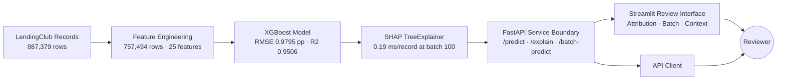
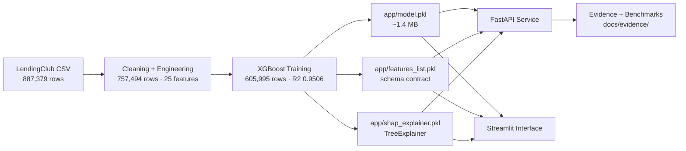
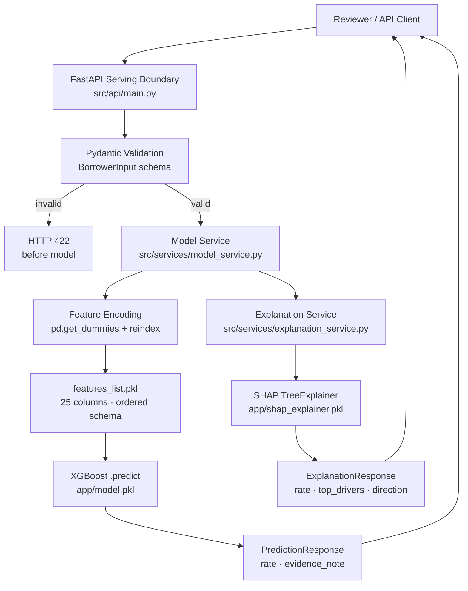
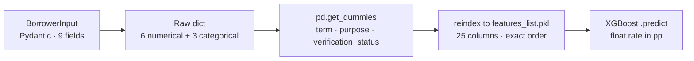
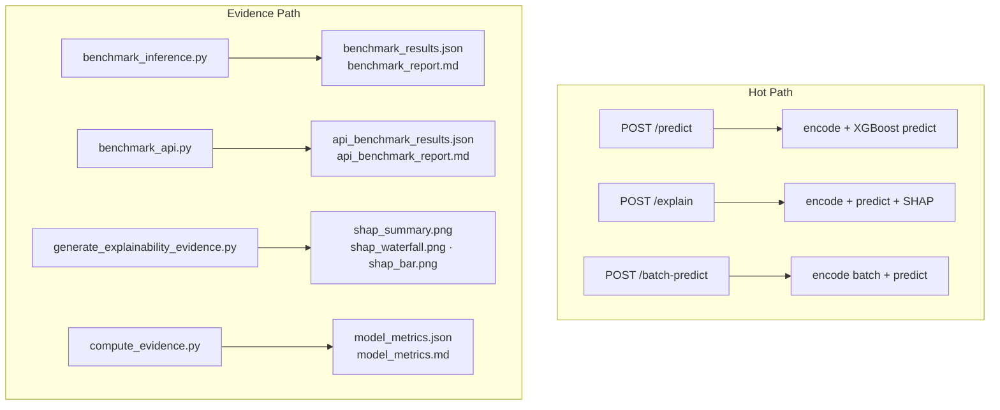

# Explainable Credit Pricing Intelligence System


An explainable ML pricing system for LendingClub borrower records that combines XGBoost interest-rate prediction, SHAP attribution, a FastAPI serving boundary, batch scoring, benchmark evidence, Docker packaging, and a Streamlit review interface.

---

## System Summary

Credit pricing review requires more than a predicted rate. A usable system must expose the predicted value, the borrower-level feature drivers, a structured serving contract, benchmark behavior, and clear system boundaries.

This system turns a trained XGBoost regression model into an explainable credit pricing workflow. SHAP attribution is computed per-prediction and returned as ranked feature drivers. A FastAPI serving boundary enforces typed input contracts and separates model inference from the review interface. A Streamlit interface provides interactive reviewer-facing exploration with inline attribution plots and batch CSV support. Every component is covered by tests, and every performance claim is grounded in a reproducible benchmark script.

---

## Quantitative Snapshot

| Dimension | Value | Source |
|---|---|---|
| Raw dataset | 887,379 LendingClub borrower records | data/loan_data.csv |
| Processed records | 757,494 | Feature engineering pipeline |
| Training split | 605,995 rows | 80/20, random_state=42 |
| Holdout split | 151,499 rows | 80/20, random_state=42 |
| Test RMSE | 0.9795 percentage points | Notebook output |
| Test R2 | 0.9506 | Notebook output |
| Test MAE | ~0.93 pp | compute_evidence.py (2K proxy) |
| Encoded features | 25 (sub_grade excluded) | app/features_list.pkl |
| Model cold load | 2,405 ms | benchmark_results.json |
| Raw inference (1 row) | 2.78 ms | benchmark_results.json |
| SHAP latency (100 rows) | 0.19 ms/record | benchmark_results.json |
| API /predict latency | 19.2 ms mean (in-process) | api_benchmark_results.json |
| API /batch-predict (100 records) | 0.18 ms/record (in-process) | api_benchmark_results.json |
| Test coverage | 41/41 passing | tests/ |
| Docker image | explainable-credit-pricing:latest (python:3.11-slim) | Dockerfile |

---

## Technology Stack

| Layer | Technology |
|---|---|
| Pricing model | XGBoost regression |
| Explainability | SHAP TreeExplainer |
| Serving boundary | FastAPI + Pydantic + uvicorn |
| Review interface | Streamlit |
| Testing | pytest + HTTPX TestClient |
| Packaging | Docker (python:3.11-slim) |
| Feature selection | LassoCV + XGBoost importance (training phase) |
| Feature encoding | pandas pd.get_dummies + reindex to features_list.pkl |
| Artifact serialisation | joblib |

---

## Business Problem

Interest-rate model outputs are difficult to trust when prediction, feature drivers, evaluation evidence, and reviewer context are separated across notebooks or static reports.

A pricing reviewer who receives a model output without attribution cannot explain it, audit it, or defend it. A model score alone is not a decision. The question is not just "what rate did the model predict?" but "which borrower features drove that rate, by how much, and is the explanation fast enough to be useful at review time?"

Without a typed serving contract, the same model can produce different outputs depending on which encoding path is used. Without benchmark evidence, there is no basis for claiming the system is fast enough for interactive use. Without tests, the validation boundary is unverified.

---

## System Objective

This system delivers:

- **Interest-rate prediction** -- XGBoost regression over 25 encoded borrower features, trained on 605,995 records
- **Borrower-level attribution** -- SHAP TreeExplainer computes per-prediction feature contributions and returns top-8 drivers with direction and magnitude
- **Structured serving boundary** -- FastAPI with Pydantic validation; invalid categorical values (wrong term, wrong verification casing) return HTTP 422 before reaching the model
- **Batch pricing support** -- /batch-predict accepts up to 10,000 records and returns ordered predictions at 0.18 ms/record in-process
- **Benchmark evidence** -- inference and API latency measured at multiple batch sizes on local hardware, with reproducible scripts
- **Review workflow** -- Streamlit interface with sidebar input, KPI display, SHAP plots, context visuals, and CSV batch upload

The intended user is a reviewer, analyst, or data scientist who needs to understand and defend a credit pricing output -- not just receive a number.

---

## System Value

| Capability | Operational effect |
|---|---|
| XGBoost pricing model | Converts borrower features into a calibrated interest-rate signal (RMSE 0.9795 pp on 151,499 holdout records) |
| SHAP attribution | Surfaces the features and directions driving each predicted rate; top-8 drivers returned per prediction |
| FastAPI serving boundary | Separates model inference from review interface; enforces input contracts; logs processing time per request |
| Pydantic validation | Rejects invalid categorical values (wrong term, wrong verification casing, negative loan amount) before reaching the model |
| Batch prediction | Supports bulk pricing review at 0.18 ms/record in-process; ordered output matches input record order |
| Benchmark evidence | Confirms local interactive feasibility at measured latency; reproducible via scripts/benchmark_inference.py and scripts/benchmark_api.py |
| Streamlit interface | Provides reviewer-facing exploration with visual SHAP attribution inline at the point of prediction |
| Docker packaging | Verifies the API can be built into a portable service image (python:3.11-slim, uvicorn startup) |

---

## Role in Workflow

This system sits between borrower-data preparation and pricing review. It accepts borrower feature records, runs XGBoost inference, computes SHAP attribution, and returns a structured prediction with ranked feature drivers. It does not approve loans or issue financial advice. It provides a structured pricing signal and attribution layer for human review.



---

## Architecture

### End-to-End Pricing Lifecycle



### Runtime Request Path



### Feature Encoding Contract



### Hot Path vs Evidence Path



---

## Model Selection Summary

Five model families were evaluated against the same LendingClub feature set before selecting XGBoost. Selection was based on holdout RMSE and R2 performance and suitability for nonlinear interactions between borrower features (loan amount, income, utilization, term).

| Model family | Role in comparison | Selected |
|---|---|---|
| Linear Regression | Linear baseline, interpretable coefficients | No |
| Decision Tree | Nonlinear, single-tree baseline | No |
| Random Forest | Ensemble baseline with feature importance | No |
| XGBoost | Gradient-boosted trees; strong on nonlinear interactions | Yes |
| FNN (Feedforward Neural Network) | Deep learning baseline | No |

XGBoost was selected based on holdout performance. Full comparative metrics are in the training notebooks (notebooks/ML_XAI_Engineered_Data.ipynb). sub_grade was excluded from all models to avoid target leakage: it directly encodes the lending-platform's own interest rate tier.

---

## Model Evidence

| Metric | Value | Evaluation set |
|---|---|---|
| Test RMSE | 0.9795 percentage points | 151,499 holdout records |
| Test R2 | 0.9506 | 151,499 holdout records |
| Test MAE | ~0.93 pp | 2K proxy sample |
| Training records | 605,995 | 80% of 757,494 |
| Encoded features | 25 | app/features_list.pkl |
| Model families compared | 5 | Training notebooks |

Raw input features: `loan_amnt`, `installment`, `annual_inc`, `revol_util`, `total_rec_int`, `inq_last_6mths`, `term`, `purpose`, `verification_status`. After one-hot encoding of the three categorical fields, the feature matrix expands to 25 columns aligned to `features_list.pkl`.

No StandardScaler is applied in the serving path. XGBoost does not require feature scaling, and the original training pipeline did not save a fitted scaler artifact. Raw numerical values are passed directly.

Full metrics: [docs/evidence/model_metrics.md](docs/evidence/model_metrics.md)

---

## Explainability Evidence

SHAP TreeExplainer is applied per-prediction and treated as a runtime attribution layer, not a notebook artifact. Three evidence plot types are generated: beeswarm (global importance across 100 test samples), waterfall (single-prediction attribution), and bar (mean absolute SHAP impact across 100 samples).

Top features by mean absolute SHAP value:

| Rank | Feature | Direction | Interpretation |
|---|---|---|---|
| 1 | loan_amnt | Positive | Higher loan amount drives rate up |
| 2 | installment | Negative | Collinear with loan_amnt; counterbalances on short terms |
| 3 | term_36 months | Negative | 36-month loans predict lower rates than 60-month |
| 4 | total_rec_int | Positive | Higher received interest drives rate up |
| 5 | annual_inc | Negative | Higher income predicts lower rate |
| 6 | revol_util | Positive | Higher utilisation predicts higher rate |

SHAP attribution latency (local benchmark, TreeExplainer):

| Batch Size | Total Time | Per Record |
|---|---|---|
| 1 row | 4.9 ms | 4.9 ms |
| 10 rows | 13.9 ms | 1.4 ms |
| 100 rows | 19.2 ms | 0.19 ms |

Evidence plots:
[shap_summary.png](docs/evidence/shap_summary.png) |
[shap_waterfall.png](docs/evidence/shap_waterfall.png) |
[shap_bar.png](docs/evidence/shap_bar.png)

---

## Service Boundary

The serving boundary separates model inference from the review interface. Input validation is enforced via Pydantic schemas: invalid categorical values return HTTP 422 before the encoding step. Every response includes a processing-time header for latency observability. Model and explainer are loaded once per process via `lru_cache`.

### Endpoints

| Method | Path | Tag | Description |
|---|---|---|---|
| GET | /health | ops | System name, model_loaded, explainer_loaded |
| POST | /predict | prediction | Single-record interest rate prediction |
| POST | /explain | explanation | Single-record prediction + top-8 SHAP drivers with direction |
| POST | /batch-predict | prediction | Batch prediction for up to 10,000 borrower records |

All responses include an `evidence_note` field and an `X-Process-Time-Ms` response header.

### Input Contract (BorrowerInput)

| Field | Type | Constraint |
|---|---|---|
| loan_amnt | float | gt=0, le=100,000 |
| installment | float | gt=0, le=5,000 |
| annual_inc | float | gt=0, le=10,000,000 |
| revol_util | float | ge=0, le=200 |
| total_rec_int | float | ge=0 |
| inq_last_6mths | int | ge=0, le=50 |
| term | Literal | "36 months" or "60 months" |
| purpose | Literal | 14 valid values (lowercase, underscored) |
| verification_status | Literal | "Not Verified", "Source Verified", "Verified" |

### Start the API

```bash
uvicorn src.api.main:app --host 127.0.0.1 --port 8000 --reload
```

Interactive docs: http://127.0.0.1:8000/docs

### Sample Request

```bash
curl -X POST http://127.0.0.1:8000/predict \
  -H "Content-Type: application/json" \
  -d '{
    "loan_amnt": 15000,
    "installment": 450.5,
    "annual_inc": 72000,
    "revol_util": 55.0,
    "total_rec_int": 1200.0,
    "inq_last_6mths": 2,
    "term": "36 months",
    "purpose": "debt_consolidation",
    "verification_status": "Verified"
  }'
```

---

## Review Interface

The Streamlit interface (`app/app.py`) provides local interactive review:

- Single-record input via sidebar sliders and selectors for all 9 borrower features
- Predicted interest rate displayed as a KPI metric
- SHAP waterfall and bar plots rendered inline at the point of prediction
- Interest rate distribution histogram and feature correlation heatmap for reviewer context
- Batch CSV upload and download for bulk review workflows

```bash
streamlit run app/app.py
```

Opens at http://localhost:8501.

---

## Benchmark Evidence

All values are local benchmark runs on developer hardware (Windows 11, Python 3.13). Production latency would depend on hosting environment, network topology, and feature pipeline design.

### Model Prediction Latency (raw XGBoost .predict(), scripts/benchmark_inference.py)

| Batch Size | Wall Time | Per Record |
|---|---|---|
| 1 row | 2.78 ms | 2,780 us |
| 10 rows | 2.51 ms | 251 us |
| 100 rows | 2.80 ms | 28.0 us |

### API Endpoint Latency (in-process TestClient, scripts/benchmark_api.py)

| Endpoint | Mean (ms) | Per Record |
|---|---|---|
| GET /health | 3.8 ms | -- |
| POST /predict (single) | 19.2 ms | 19.2 ms |
| POST /explain (single) | 22.9 ms | 22.9 ms |
| POST /batch-predict (10 records) | 17.8 ms | 1.78 ms |
| POST /batch-predict (100 records) | 18.4 ms | 0.18 ms |

API latency includes JSON parsing, Pydantic validation, feature encoding, FastAPI middleware, and TestClient serialisation overhead. Raw XGBoost inference is 2-3 ms of the total. The gap between raw inference latency (2.78 ms) and API endpoint latency (19.2 ms) reflects encoding, validation, and framework overhead, not model cost.

### Model Cold Load

| Artifact | Cold Load Time |
|---|---|
| app/model.pkl | 2,405 ms (includes XGBoost legacy pickle overhead) |

Full inference benchmark: [docs/evidence/benchmark_results.json](docs/evidence/benchmark_results.json)
Full API benchmark: [docs/evidence/api_benchmark_results.json](docs/evidence/api_benchmark_results.json)

---

## Testing Evidence

The test suite validates model service encoding, prediction correctness, API contract enforcement, and boundary conditions.

| Suite | Tests | Coverage |
|---|---|---|
| tests/test_model_service.py | 16 | Artifact loading, encoding correctness (term and verification_status columns), single and batch prediction, batch/single result consistency |
| tests/test_api.py | 25 | /health (status, model flag, system name), /predict (200 for valid, 422 for invalid term, wrong verification casing, negative loan_amnt, missing field), /batch-predict (count, type, single consistency, empty list 422), /explain (200 or 503) |
| Total | 41/41 passing | -- |

```bash
python -m pytest tests/ -v
```

---

## Docker and Packaging

```bash
docker build -t explainable-credit-pricing .
docker run -p 8000:8000 explainable-credit-pricing
```

Image: `explainable-credit-pricing:latest` | Base: `python:3.11-slim` | Content: 777 MB

The Dockerfile installs dependencies, copies `src/`, model artifacts (`model.pkl`, `features_list.pkl`, `shap_explainer.pkl`), and starts uvicorn on port 8000. The image was built locally and verified to build cleanly. It has not been pushed to a container registry or deployed to a cloud runtime.

---

## Core Components

| Component | File | Responsibility |
|---|---|---|
| Model artifact | app/model.pkl | Trained XGBoost regression model (~1.4 MB, joblib) |
| Feature schema | app/features_list.pkl | Ordered list of 25 encoded column names; schema contract across all prediction paths |
| SHAP explainer | app/shap_explainer.pkl | Pre-saved TreeExplainer; service falls back to dynamic build on version mismatch |
| Config | src/core/config.py | Centralised artifact paths (pathlib), valid categorical values, feature groupings |
| Schemas | src/schemas/prediction.py | Pydantic models: BorrowerInput, PredictionResponse, ExplanationResponse, BatchPredictionResponse, HealthResponse |
| Model service | src/services/model_service.py | Load model and feature list once (lru_cache); encode BorrowerInput; run single and batch predictions |
| Explanation service | src/services/explanation_service.py | Load SHAP explainer (with fallback); compute top-N drivers; return structured ExplanationResponse |
| API | src/api/main.py | FastAPI routes with timing middleware; all endpoints log processing time and return X-Process-Time-Ms header |
| Review interface | app/app.py | Streamlit UI: sidebar input, KPI metrics, inline SHAP plots, distribution and correlation visuals, batch CSV upload |
| Inference benchmark | scripts/benchmark_inference.py | Reproducible prediction and SHAP latency measurement at 1/10/100 rows |
| API benchmark | scripts/benchmark_api.py | In-process TestClient benchmark for all endpoints; saves JSON and markdown reports |
| SHAP evidence | scripts/generate_explainability_evidence.py | Reproducible beeswarm, waterfall, and bar plot generation |
| Evidence pipeline | docs/evidence/compute_evidence.py | Reproducible metrics and SHAP generation against current data sample |

---

## Engineering Decisions

| Layer | Artifact | Role |
|---|---|---|
| Training | notebooks/ML_XAI_Engineered_Data.ipynb | XGBoost training, evaluation, feature selection |
| Config | src/core/config.py | Single source for paths and valid categorical values |
| Schemas | src/schemas/prediction.py | Pydantic request/response contracts |
| Model service | src/services/model_service.py | Load once (lru_cache), encode, predict |
| Explanation service | src/services/explanation_service.py | SHAP load with fallback; top-N drivers |
| API | src/api/main.py | FastAPI routes with timing middleware |
| Feature schema | app/features_list.pkl | Schema contract across all prediction paths |

**XGBoost for pricing model.** XGBoost handles nonlinear interactions between borrower features (loan amount, installment, income, utilization) without requiring feature scaling. No StandardScaler is applied in the serving path. Raw numerical values are passed directly, matching the original training pipeline and eliminating train/serve scaler-state mismatch.

**SHAP TreeExplainer for attribution.** SHAP provides exact Shapley values for tree models. Attribution is computed at runtime per prediction, not cached or approximated. The explainer is loaded once at service startup via `lru_cache` to avoid repeated deserialization overhead across requests.

**features_list.pkl as schema contract.** The 25-column ordered feature list is serialized and loaded by every prediction path (Streamlit, FastAPI service, benchmark scripts). This eliminates column ordering bugs at the encoding boundary. Any path that skips this contract risks silent column mismatches and zero-filled dummy columns.

**FastAPI boundary after model evidence.** The serving boundary was introduced after the model, explainability, and benchmark evidence were established. Pydantic validation enforces exact categorical values (Literal types for term, purpose, verification_status). Invalid inputs return HTTP 422 before reaching the model, preventing silent encoding failures.

**Evidence docs as versioned artifacts.** Benchmark results, SHAP plots, and metrics are stored as reproducible files in `docs/evidence/` rather than being embedded in the README. Claims are grounded in scripts that can be re-run.

---

## Key Design Tradeoffs

| Tradeoff | Decision | Reasoning |
|---|---|---|
| XGBoost vs fully interpretable model | XGBoost with post-hoc SHAP | RMSE 0.9795 pp achieved; SHAP restores feature-level transparency without limiting model capacity |
| Per-request SHAP vs pre-cached explanations | Per-request | Avoids Redis dependency; 4.9 ms per single record is acceptable for interactive use; caching is a documented future step |
| Streamlit review UI vs production frontend | Streamlit | Appropriate for local review scope; FastAPI boundary cleanly separates model serving for future frontend replacement |
| Local benchmark evidence vs cloud deployment | Local benchmarks | Establishes baseline before any deployment; measurements are qualified as local hardware results |
| Legacy XGBoost pickle vs JSON artifact | Preserved legacy format | Existing artifact kept; re-saving in JSON format is a documented future step to eliminate load-time warning |
| No scaler in serving path | None applied | XGBoost does not require feature scaling; no scaler was saved from the training run; omitting it matches the original training pipeline |
| Single-record SHAP via /explain vs batch SHAP | Single-record only | /batch-predict serves throughput use cases without SHAP overhead; per-record SHAP is available via /explain for selective attribution |

---

## System Scope and Boundaries

This system is designed as a local explainable ML pricing workflow and engineering evidence system. It demonstrates model training, SHAP attribution, FastAPI serving, batch prediction, test coverage, benchmark evidence, Docker packaging, and documented system boundaries. It is not positioned as a production lending platform, loan approval engine, or financial advice system.

Detailed claim boundaries are maintained in [docs/evidence/claim_safety.md](docs/evidence/claim_safety.md).

Technical boundaries:

- The XGBoost model was trained on the full 757,494-row dataset. The current `data/interest_rate_df_engineered.csv` is a 2,000-row demo sample used for local review; the model artifact reflects the full training run.
- Test MAE of ~0.93 pp is from the 2K proxy run. MAE was not recorded in the original full training notebook.
- The model is saved in legacy XGBoost pickle format. Re-saving in JSON format would eliminate the load-time version warning.
- The FastAPI serving boundary does not include prediction persistence or authentication. Both are in the engineering roadmap.
- The Docker image was built locally and has not been pushed to a registry or deployed to a cloud runtime.
- All latency values are local benchmark measurements on developer hardware. Production latency would depend on hosting environment, network topology, and feature pipeline design.

---

## Engineering Roadmap

### Completed

| Item | Status |
|---|---|
| XGBoost model training (605,995 records, RMSE 0.9795 pp) | Done |
| SHAP explainability (3 plot types, latency benchmarked) | Done |
| FastAPI serving boundary (/predict, /explain, /batch-predict, /health) | Done |
| Pydantic input validation (BorrowerInput, 422 on invalid categorical values) | Done |
| 41/41 pytest coverage | Done |
| Inference and API benchmarks (reproducible scripts) | Done |
| Docker image build (python:3.11-slim) | Done |
| Streamlit preprocessing bug fix (encoding alignment for term and verification_status) | Done |
| SHAP explainer regenerated for Python 3.13 compatibility | Done |

### Next Possible Extensions

| Extension | Description |
|---|---|
| Prediction persistence | PostgreSQL log of each prediction with input hash, output, timestamp, and model version |
| Authentication and RBAC | JWT-based auth, role-based permissions, full request audit trail |
| MLflow model registry | Versioned model artifacts with staging and production promotion |
| Drift monitoring | Feature and prediction distribution tracking (Evidently or equivalent) |
| CI/CD pipeline | GitHub Actions for automated tests, benchmarks, and Docker build validation |
| SHAP caching | Redis cache on input hash to reduce repeated explanation computation |
| Cloud deployment | After security review, dependency audit, and container registry setup |

Full detail: [docs/evidence/scale_path.md](docs/evidence/scale_path.md)

---

## Repository Structure

```
explainable-loan-interest-prediction/
├── app/                              # Streamlit interface + model artifacts
│   ├── app.py                        # Streamlit review interface
│   ├── model.pkl                     # Trained XGBoost model (~1.4 MB)
│   ├── features_list.pkl             # 25-feature schema contract
│   └── shap_explainer.pkl            # Pre-saved SHAP TreeExplainer
├── data/                             # LendingClub datasets
│   ├── loan_data.csv                 # Raw: 887,379 records
│   └── interest_rate_df_engineered.csv  # Current: 2,000-row demo sample
├── docs/evidence/                    # All measured evidence artifacts
├── models/                           # Additional model artifacts
├── notebooks/                        # EDA, preprocessing, and training
│   └── ML_XAI_Engineered_Data.ipynb  # Primary training notebook
├── scripts/                          # Reproducible benchmark and evidence scripts
│   ├── benchmark_inference.py        # Raw model inference latency
│   ├── benchmark_api.py              # FastAPI endpoint latency
│   └── generate_explainability_evidence.py  # SHAP plot generation
├── src/                              # Service source package
│   ├── api/
│   │   └── main.py                   # FastAPI app
│   ├── core/
│   │   └── config.py                 # Centralised paths and constants
│   ├── schemas/
│   │   └── prediction.py             # Pydantic request/response models
│   └── services/
│       ├── model_service.py          # Model loading and prediction
│       └── explanation_service.py    # SHAP attribution
├── tests/
│   ├── test_model_service.py         # 16 model service tests
│   └── test_api.py                   # 25 API endpoint tests
├── Dockerfile
├── .dockerignore
├── requirements.txt
└── README.md
```

---

## Getting Started

```bash
git clone https://github.com/IjazKakkodDS/explainable-loan-interest-prediction.git
cd explainable-loan-interest-prediction
pip install -r requirements.txt
```

### FastAPI Serving Boundary

```bash
uvicorn src.api.main:app --host 127.0.0.1 --port 8000 --reload
```

Interactive docs: http://127.0.0.1:8000/docs

### Streamlit Review Interface

```bash
streamlit run app/app.py
```

Opens at http://localhost:8501.

### Tests

```bash
python -m pytest tests/ -v
```

### Inference Benchmark

```bash
python scripts/benchmark_inference.py
```

### API Benchmark

```bash
python scripts/benchmark_api.py
```

### Regenerate SHAP Evidence Plots

```bash
python scripts/generate_explainability_evidence.py
```

### Regenerate Full Evidence Set

```bash
python docs/evidence/compute_evidence.py
```

---

## Evidence Index

| File | Contents |
|---|---|
| [docs/evidence/benchmark_results.json](docs/evidence/benchmark_results.json) | Raw inference latency at 1/10/100 rows |
| [docs/evidence/benchmark_report.md](docs/evidence/benchmark_report.md) | Human-readable inference benchmark |
| [docs/evidence/api_benchmark_results.json](docs/evidence/api_benchmark_results.json) | API endpoint latency (in-process) |
| [docs/evidence/api_benchmark_report.md](docs/evidence/api_benchmark_report.md) | Human-readable API benchmark |
| [docs/evidence/model_metrics.json](docs/evidence/model_metrics.json) | RMSE, MAE, R2, SHAP latency |
| [docs/evidence/model_metrics.md](docs/evidence/model_metrics.md) | Readable metrics with dataset chain |
| [docs/evidence/shap_summary.png](docs/evidence/shap_summary.png) | SHAP beeswarm (100 test samples) |
| [docs/evidence/shap_waterfall.png](docs/evidence/shap_waterfall.png) | SHAP waterfall (single prediction) |
| [docs/evidence/shap_bar.png](docs/evidence/shap_bar.png) | SHAP mean absolute feature impact |
| [docs/evidence/system_design_notes.md](docs/evidence/system_design_notes.md) | Full architecture and efficiency notes |
| [docs/evidence/scale_path.md](docs/evidence/scale_path.md) | Production extension path |
| [docs/evidence/claim_safety.md](docs/evidence/claim_safety.md) | Claim boundaries reference |
| [docs/evidence/portfolio_summary.md](docs/evidence/portfolio_summary.md) | Portfolio-ready copy |
| [docs/evidence/evidence_inventory.md](docs/evidence/evidence_inventory.md) | Complete artifact inventory |
| [docs/evidence/l2_engineering_upgrade_report.md](docs/evidence/l2_engineering_upgrade_report.md) | L2 service layer: files added, tests, benchmarks, findings |

---

## Author

**Ijaz Kakkod**
Machine Learning Systems | Explainable AI | Model Governance

[](https://linkedin.com/in/ijazkakkod)
[](https://github.com/IjazKakkodDS)

ijazkakkod@gmail.com

---

## License

MIT License. See [LICENSE](LICENSE) for details.
